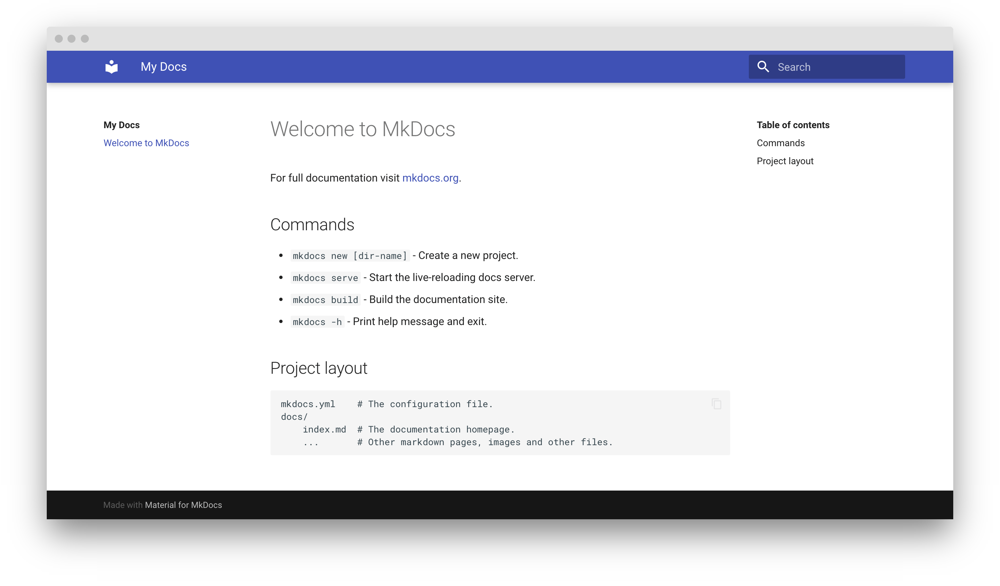

# Kannan's MkDocs

Welcome to **Kannan's MkDocs** — the place to document everything you **learn**, **code**, and **fix**. Use this as your personal knowledge base to keep track of your development journey.

## 🚀 Install Setup

**Material for MkDocs** is a powerful and elegant documentation theme built on top of **MkDocs**, a static site generator.

### 📦 Installation via `pip`

Material for MkDocs is available as a Python package and can be installed with `pip`. It's recommended to use a virtual environment.

```bash
pip install mkdocs-material
````

---

## 📁 Creating Your Site

Once Material for MkDocs is installed, create a new documentation site using the `mkdocs` CLI.

Navigate to the directory where you want your documentation project and run:

```bash
mkdocs new .
```

This will generate the following structure:

```
.
├── docs/
│   └── index.md
└── mkdocs.yml
```

---

## ⚙️ Configuration

To enable the Material theme, update your `mkdocs.yml` configuration file as follows:

```yaml
site_name: My site
site_url: https://mydomain.org/mysite

theme:
  name: material
```

You can customize `site_name` and `site_url` to fit your project.

---

## 📝 Previewing as You Write

MkDocs comes with a built-in **live preview server** that automatically refreshes your site when you save changes.

To start the server, run:

```bash
mkdocs serve
```

Then open your browser and visit:

[http://localhost:8000](http://localhost:8000)

You should see your site up and running!



---